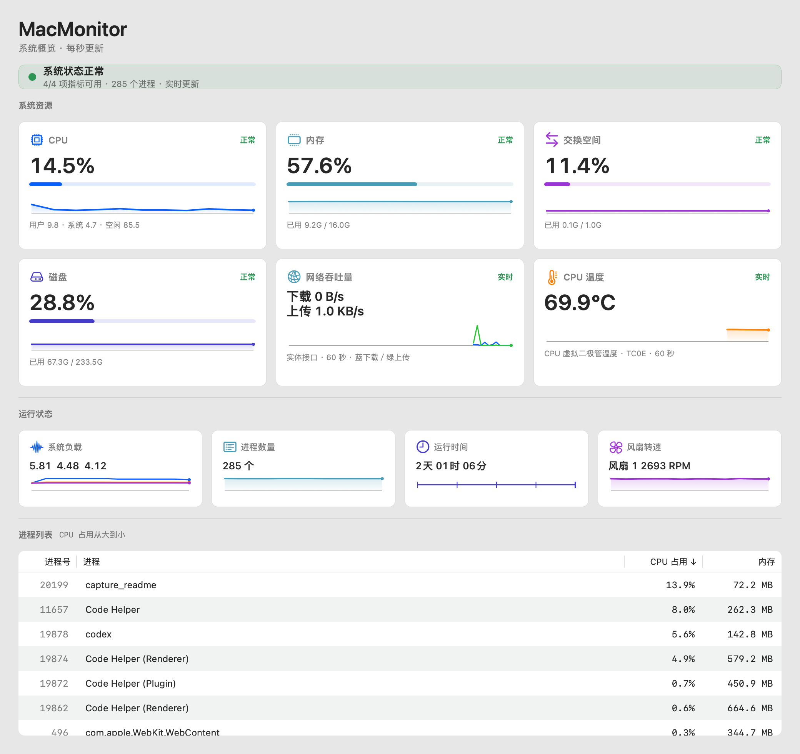

# macmon

macOS 的 CPU / 内存 / 风扇 / 网络吞吐量 / CPU 温度实时监视器，纯 C 采样核心 + AppKit GUI + ncurses TUI，
只依赖系统自带的框架和库。

## 图形界面



实际运行截图。网络吞吐量与 CPU 温度使用独立卡片，进程表支持 CPU／内存三态排序。

## 终端界面

```
 MacMonitor  23:09:44  1.00秒  采样中
 q 退出   +/- 调速   c CPU排序 / m 内存排序   空格 暂停/继续
 CPU    33.9%    [██████████████░░░░░░░░░░░░░░░░░░░░░░░░░░░]  用户 31.4  系统 2.5  空闲 66.1
 内存   65.9%    [███████████████████████████░░░░░░░░░░░░░░]  10.5G / 16.0G   联动 2.9G   压缩 1.7G
 交换   61.3%    [█████████████████████████░░░░░░░░░░░░░░░░]  1.2G / 2.0G
 磁盘   29.9%    [████████████░░░░░░░░░░░░░░░░░░░░░░░░░░░░]  69.9G / 233G   可用 164G
 风扇   4181 RPM [█████████████████████░░░░░░░░░░░░░░░░░░░░]  最低 2700   最高 8000
 网络   下载 12.5 MB/s  上传 1.2 MB/s
 温度   63.4°C

 CPU 60秒     ▃▃▅▆▇█▇▆▅▃▂▁▂▃▅▆▇█▇▆▅▃▂▁▂▃▄▅▆▇█▇▆▅▃▂▁▂▃
 进程 64  负载 9.60 7.62 7.09  运行 33天04时38分

 进程号  进程名称                                   CPU%↓    内存
 ──────────────────────────────────────────────────────────────
 32648   Code Helper (Renderer)                    121.9    3.2G
 32568   Code Helper                                 4.3   80.9M
 32733   claude                                      0.7    333M
 33528   macmon                                      3.5    1.9M
```

## 编译运行

```sh
make
./macmon
```

需要 macOS 12+ 自带的 Command Line Tools（clang + 系统 ncurses、IOKit 和 SystemConfiguration），没有第三方依赖。

| 按键 | 作用 |
| --- | --- |
| `q` | 退出（**故意不做 `Esc` 退出**，原因见下） |
| `+` / `-` | 刷新间隔在 0.25s ~ 5s 之间加减 |
| `c` / `m` | 进程列表按 CPU / 内存排序 |
| `空格` | 暂停采样（保留当前画面） |

## 打包成 macOS 应用

```sh
make app          # 生成 MacMonitor.app，双击即可运行
make release      # 生成包含 GUI、TUI、使用说明和更新日志的通用架构成品包
```

包是通用二进制（x86_64 + arm64），用 ad-hoc 签名，本机跑不需要开发者证书。

当前成品为 [MacMonitor 1.1.0](releases/1.1.0/MacMonitor-1.1.0-macos-universal.zip)，
压缩包包含 `MacMonitor.app`、通用架构 `macmon` 及中文说明。
[SHA-256 校验值](releases/1.1.0/SHA256SUMS.txt)和[逐文件改动说明](docs/releases/1.1.0.md)随仓库保存。

`Contents/MacOS/MacMonitor` 现在直接承载原生 AppKit 窗口，采样核心在后台线程运行，
双击应用不需要启动 Terminal.app。GUI 跟随系统明暗模式，六张资源与观测卡在宽窗口中三列排列，
窄窗口中自动切换为两列；进程表点击 CPU 或内存列标题依次切换降序（↓）、升序（↑）、默认排序（无箭头）。
默认沿用 CPU 占用从高到低排列；切换到另一列时从降序开始，相同占用按进程号从小到大排列。
TUI 使用中文界面，并按终端显示列宽裁剪文字。TUI 仍可用 `./macmon` 运行；[旧启动脚本](docs/archive/launcher.sh)
仅保留作历史参考，不参与当前打包。

应用使用独立的监视屏幕与波形图标；`make app` 通过 Python 3 标准库绘制完整尺寸的
PNG 图标集，再用系统 `iconutil` 打包，无需安装第三方包。GUI 内的资源图标使用 SF Symbols，
在异常状态下保留资源图形，并用颜色标记状态。

`make test` 运行核心测试；`make test-gui` 在已登录的 macOS 图形会话中验证快速关闭、
采样后关闭、关闭后的事件池清理和直接退出，确保窗口关闭不崩溃且定时器与采样线程正常停止。
图形测试还覆盖新增指标的来源、零流量与不可用提示，以及宽窄布局。
`make test-tui` 使用真实伪终端验证指标显示、暂停缩放及窄窗口恢复。

要分享给别人：ad-hoc 签名的应用**没有经过公证**，对方第一次打开会被 Gatekeeper 拦下
（"无法验证开发者"）。让他右键 → 打开，或者先执行
`xattr -dr com.apple.quarantine MacMonitor.app`。

## 网络与温度

网络和 CPU 温度分别使用独立卡片，连同原有八张卡片共十张。终端只显示下载、上传速率和温度数字，
缺测时显示原因；完整布局需要至少 46 列、17 行，每个风扇额外占一行。

网络按联网实体接口分别读取 64 位累计字节数，再以真实经过时间计算整机上传／下载速率，包含局域网流量。
回环、VPN 等虚拟接口不再叠加，VPN 在实体接口上的传输开销仍计入。B/s、KB/s、MB/s 使用十进制单位。
首次采样、接口变化或计数重置时显示“正在采样”；有效零流量显示 `0 B/s`，断网与查询失败分别显示原因。

CPU 温度来源依次优先选择封装、直接二极管／已确认的代表核心、虚拟二极管、过滤二极管和邻近传感器。
卡片显示实际口径及传感器键，不能把邻近或虚拟读数称为封装温度。接口只读，不修改风扇或硬件参数。
Intel MacBook Air（MacBookAir8,2）已验证普通用户读取 `TC0E`；Apple M1～M5 使用来源代码中已列明的代表核心键，
尚未经过 Apple Silicon 实机验证。未知机型、无传感器或访问受限时显示“不支持或不可用”，已读来源失败显示“读取失败”。
传感器映射参考 [Stats 的传感器表](https://github.com/exelban/stats/blob/master/Modules/Sensors/values.swift#L329)
与 [CPU 温度读取器](https://github.com/exelban/stats/blob/master/Modules/CPU/readers.swift#L249)。

图形界面的两项新增趋势按真实时间保留最近 60 秒；缺测、暂停恢复和温度来源变化处断开。暂停冻结读数与图表，
恢复时立即采样，并重建网络差分基线。现有 CPU 占用历史仍采用原有 60 点窗口。

## 代码结构

采样核心与两个前端各自只暴露一个窄接口：

- [src/core.c](src/core.c) — 后台采样线程、不可变快照与暂停/排序/间隔控制
- [src/sysinfo.c](src/sysinfo.c) — 整机 CPU、内存、Swap、磁盘、负载、开机时长
- [src/proclist.c](src/proclist.c) — 进程快照、CPU 与内存占用、排序
- [src/smc.c](src/smc.c) — 风扇转速与有明确来源的 CPU 温度（IOKit 直连 AppleSMC）
- [src/network.c](src/network.c) — 实体接口筛选、64 位计数与网络速率差分
- [src/history.c](src/history.c) — 图形界面新增指标的真实时间窗口计算与趋势断点处理
- [src/ui.c](src/ui.c) — ncurses 绘制与终端尺寸同步
- [src/main.c](src/main.c) — ncurses TUI 按键处理与快照渲染
- [src/gui.m](src/gui.m) — AppKit 图形界面

打包相关文件单独放在 [packaging/](packaging/)，不属于程序本身：
`Info.plist`（模板，版本号由 Makefile 注入）、`make-icon.py`（应用图标绘制）。

项目其余文件按用途组织：

```text
src/                          采样核心、TUI 和 GUI 源码
tests/                        核心单元测试和 GUI 生命周期测试
packaging/                    当前应用打包模板和图标生成脚本
docs/
  adr/                        架构决策
  agents/                     工程技能的项目约定
  audits/2026-10-02/           审计报告和原始证据
  archive/                    早期笔记和已退役的启动脚本
.scratch/modernization/       现代化改造 spec 和独立 tickets
.claude/skills/run-macmon/     TUI 端到端测试技能和驱动
build/                        编译产物、测试程序和临时抓屏
```

[文档导航](docs/README.md)汇总各类资料；[GLOSSARY.md](GLOSSARY.md)定义项目领域术语，
[CHANGELOG.txt](CHANGELOG.txt)保留更新记录。

TUI 驱动的 `ss` 命令默认将抓屏保存到 `build/screens/`，可用 `--screens <目录>` 指定其他位置。
已有的临时抓屏已移入该目录；`make clean` 会清理整个 `build/`。需要长期保留的测试证据放在
`docs/audits/<日期>/evidence/`。

## 几个值得注意的实现细节

**百分比是"速率"，不是瞬时值。** CPU 和进程占用都来自累计计数器的差分，所以
`sysinfo_cpu()` 和 `proclist_sample()` 内部各自记住上一次的采样。这意味着**连续两次
调用之间必须有已知的时间间隔**，程序启动时会先空跑一次采样，否则第一帧全是 0。

这条契约得靠代码守住，不能靠自觉。主循环因此由**单调时钟的截止时刻**驱动，而不是由
`ui_wait()` 的超时驱动——`getch()` 对一个已经缓冲好的按键会立刻返回，所以只要输入不断
到来，超时就形同虚设。间隔一旦被输入压到毫秒级，差分就变成噪声：一个 tick 是 10ms，4 核
机器在 1ms 的窗口里一共只能攒到个位数的 tick，`busy%` 于是只能落在少数几个离散值上——
实测 1.2ms 采样间隔下，取值集合就是 {0, 33.3, 50, 100}，进度条看着就是在 0% 和 100%
之间横跳；进程占用则变成"这几毫秒里谁被调度过"的随机数，排序每帧洗一次牌。两个采样器自己
也各有一道下限（`MIN_TICKS`、`MIN_ELAPSED_NS`）：窗口太短时沿用上一次的读数、并且**不推进
基线**，让下一次量的窗口自己变宽——报一个陈旧的速率，也好过报一个由噪声算出来的速率。

截止时刻是从上一个截止时刻递推的，不是从当前时刻起算，所以间隔不会被采样本身的耗时带偏；
阻塞期间错过的截止时刻直接跳过而不是补跑，因为补跑会连着触发采样，正是这里要避免的事。

**CPU tick 是 32 位的。** `host_processor_info()` 返回的计数器是 `natural_t`，按
100Hz 算大约 497 天回绕一次。代码里保留原始值、用 `uint32_t` 相减，跨回绕仍然正确。

**内存口径对齐活动监视器。** "已用内存" = 应用内存 + 联动内存 + 已压缩内存。应用内存
取 `internal_page_count - purgeable_count`——可清除的页内核随时能收回，不该算作占用。
`external_page_count` 是文件缓存，保存在 `mem.cached`，当前面板不把它计入已用内存。

**进程 CPU 可以超过 100%。** 这是 top 的惯例：数值表示占**单个核心**的百分比，所以一个
多线程进程跑到 400% 意味着它吃满了 4 个核。

**libproc 返回的 CPU 时间已经是纳秒**，不需要再乘 `mach_timebase_info`。这一点是在本机
实测确认的（用忙循环对比墙钟时间），因为它在 Intel 和 Apple Silicon 上的换算方式不同，
很容易写错。

**风扇转速没有公开 API。** 唯一的入口是 IOKit 的 AppleSMC 用户客户端，它的请求结构体
没有任何头文件描述，只能手写。`IOConnectCallStructMethod` 是原样转发这段内存的，所以
字段顺序就是 ABI，改动或重排会让内核侧读到垃圾数据——`smc.c` 顶部那段结构体定义不能动。

**SMC 的数值有多种编码，而且可以混用。** 同一台机器上转速可能是 `flt `（小端浮点），
上下限可能是 `fpe2`（定点），温度可能是 `sp78`（有符号 8.8 定点）。所以要按 key 自己声明的 `dataType` 解码，不能统一假设。
本机实测 `F0Ac`/`F0Mn`/`F0Mx` 都是 `flt `。

**滚动终端会让画面错位，所以做了三件事。** 程序跑在终端的备用屏幕里（ncurses 启动时发
`\E[?1049h`），但 Terminal.app、VS Code 的 xterm.js 等仍然允许在备用屏幕里滚动，滚轮会被
翻译成方向键发给程序。于是有三个后果：

其一，视口被移动了，而 ncurses 看不见这件事——它仍然按自己记录的"屏幕上现在是什么"做
**增量**更新，只重写变化的单元格。这份记录一旦过期，重绘就会落在错误的位置上，表现就是
进度条长度错乱。所以收到滚动类按键（方向键、翻页键、滚轮）时会调用 `redrawwin()` 强制
整屏重写；滚动条拖动不产生任何输入，另加了一个 15 秒的定时兜底。用 `redrawwin()` 而不是
`clearok()` 是因为它原地重写、不清屏，所以不闪。

但重绘不能按事件来。一次两指滑动是几十上百个按键成串到达，每个都整屏重写一遍就是上百帧、
接近 200KB/s，终端画不赢，画面反而更花。所以循环会先把**已经排队**的按键一次排空
（上限 `DRAIN_MAX`，防止按住不放的自动重复把重绘饿死），由一帧来回应整串；`repaint_all`
是粘滞标志，因此一串滚动只花掉一次整屏重写。另外还有一道 20fps 的帧率上限
（`MIN_FRAME_SECS`）：数据最快也就每秒变一次，比这更频繁到来的只可能是滚动，而滚动只是
要求重新同步画面。

其二，**普通模式方向键不在 terminfo 里，得自己教给 ncurses。** `\E[A` 这类序列（也正是
滚轮发出的那些）ncurses 不认得，于是退回一个裸 ESC，再把剩余字节当成用户手打的字符逐个
交出来。这有两个恶果：`\E[C`（横向滑动发出的）以 `'C'` 结尾，而 `'C'` 正好是"按 CPU
排序"的快捷键——一次斜向滑动就能把进程列表的排序在读者眼皮底下翻掉；同时每个滚动事件还
变成了三次循环迭代。`ui_init()` 里用 `define_key()` 把 `\E[A .. \E[D` 注册成
`KEY_UP`/`KEY_DOWN`/`KEY_RIGHT`/`KEY_LEFT`，两个问题一起解决——实测注册后 ncurses 返回的
是 `259/258/261/260`，不再泄漏裸字符，`main.c` 里那个 `KEY_UP` 分支也才真正活了过来。

其三，**ESC 不能当退出键**。它是所有转义序列的前缀，任何一个没被认出来的序列都会退回裸
ESC——如果 ESC 绑定了退出，一滚动程序就没了。这个 bug 在开发时真的复现过：往程序发
`\x1b[A`、`\x1b[B` 甚至单个 `\x1b`，都会让它以退出码 0 干净退出。现在只保留 `q` 退出。

## 已知限制

- 需要真实的 tty。TERM 未设置时会给出明确提示而不是直接崩掉，但仍然需要一个终端。
- 非 root 身份只能看到自己的进程；想看全部进程用 `sudo ./macmon`。
- 终端小于 46 列 × 17 行（每个风扇再加一行）时会提示“终端太小”，而不是画一个
  残缺的界面。
- 风扇需要 SMC 且需要权限。本机（MacBookAir8,2）普通用户即可读取，不需要 sudo；但虚拟机
  里没有 AppleSMC，某些系统加固策略也可能拒绝。这些情况下 FAN 行会整行消失，其余功能照常
  ——`ui_draw()` 收一个可为 NULL 的 `fan_info_t *`，为 NULL 时不多画任何东西。
- 无风扇的 Mac（12 吋 MacBook、M1 MacBook Air）上 SMC 会回答 `FNum = 0`，同样不显示 FAN 行。

## 可以继续做的

- 进程采样的开销：基线约 4.4ms，其中几百个 PID 各一次 `proc_pidinfo`，进程名现在按
  PID 缓存；CPU 基线查找仍是 O(n²)，但实测只占约 2–4%，不能宣称能削掉大半。采样每秒
  一次时约占 0.44% 的一个核。
- 点击/方向键选择进程、发信号（注意：这是个破坏性操作）。
- 每核 CPU 占用：`host_processor_info()` 本来就返回每个核的 tick，现在的代码把它们求和了。
- 磁盘 I/O：`iostat` 那套走 `IOKit`，会比现在这些复杂不少。
- 自己控制风扇：`F0Tg` 是目标转速（本机 `flt `，实测跟着 `F0Ac` 走）。理论上往它写值就能
  调速，**但本项目没有实现也没有测试过写操作**。真要做得自己确认权限和取值边界——写错
  可能让机器过热或风扇狂转，而这是真实的硬件副作用，不是能随便试的。

调试用 `make sanitize`（ASan + UBSan）；产物是独立的 `macmon-sanitize`，不会污染常规构建的 `build/`。

注意 macOS 上**没有** LeakSanitizer：`ASAN_OPTIONS=detect_leaks=1` 不会去查内存泄漏，
而是让程序在启动瞬间直接退出（只打印一行 `detect_leaks is not supported on this
platform`）。想查泄漏得用 `leaks` 命令配合 `MallocStackLogging`。
